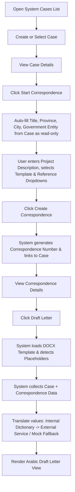
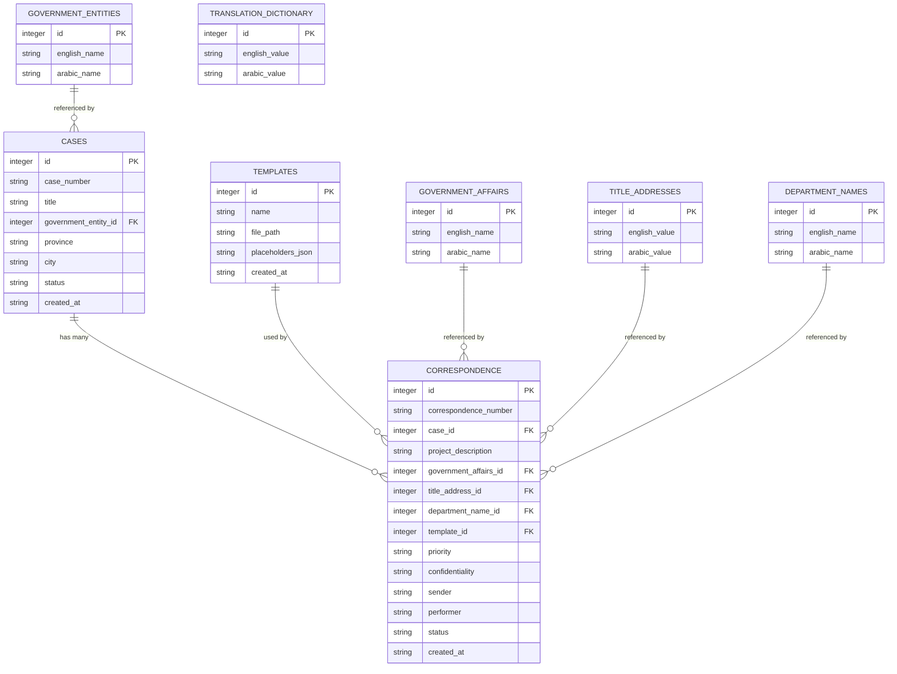
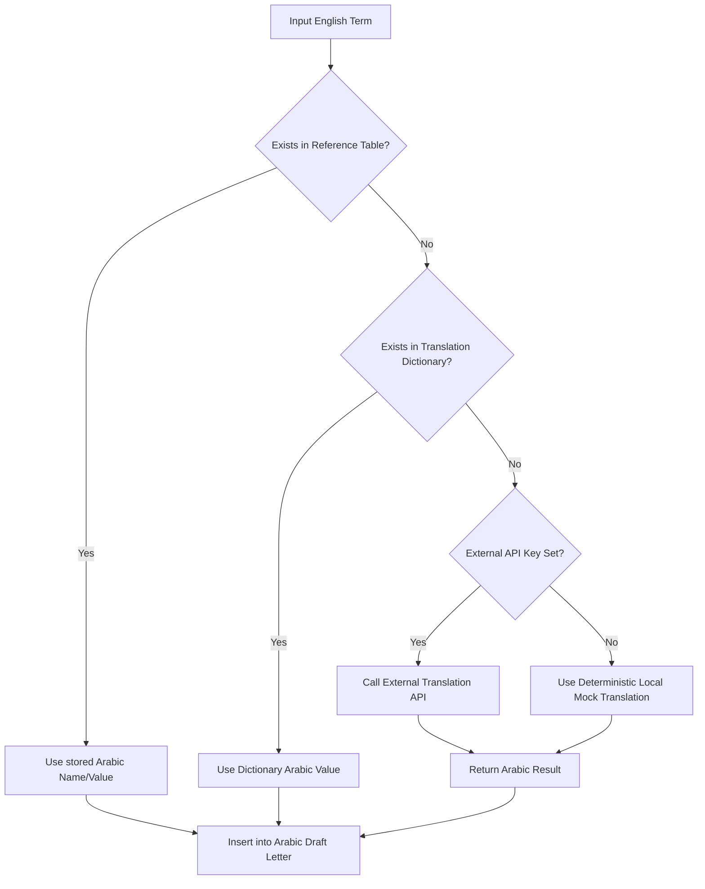

# Implementation Plan: Case & Correspondence Management System — Functional Prototype

This document outlines the system architecture, database schema, workflow mechanics, and component structure for the **Case & Correspondence Management System**.

---

### Clarified Requirements & Key Design Principles

1. **Case-Driven Auto-Filling**:
   * `Title`, `Government Entity`, `Province`, and `City` are provided during **Create Case** and persisted in the `CASES` record.
   * When navigating to **Start Correspondence** from an existing Case, all four fields (`Title`, `Government Entity`, `Province`, `City`) automatically carry over and render as **read-only** inputs labeled **"Auto-filled from Case"**.
   * The user does **NOT** re-enter `Province` or `City` in Correspondence.

2. **Modular Translation Architecture**:
   * **Tier 1**: Direct Database Reference lookup (if reference items have stored `arabic_name`/`arabic_value`).
   * **Tier 2**: Internal `TRANSLATION_DICTIONARY` query for exact/case-insensitive English string matches.
   * **Tier 3**: Modular translation service fallback. Supports external API integration (e.g. Google Translate) if `TRANSLATION_API_KEY` is configured, or automatically falls back to a deterministic local mock translator if no API key is set.

3. **Generic & Non-Confidential Sample Data**:
   * All sample cases and templates strictly use standard generic terminology (e.g., `Example Project Work Permit` instead of proprietary corporate names).

---

### 1. Technology Choices

For a simple, responsive, and persistent functional prototype, the following stack is selected:

* **Frontend Framework**: React (via Vite) with React Router DOM for clean client-side SPA routing.
* **UI & Styling**: Tailwind CSS styled specifically to reflect a formal corporate internal system (navy/dark blue accents, clean white backgrounds, tablet/iPad style spacing, crisp typography).
* **Backend Server**: Node.js with Express.js for simple modular REST endpoints.
* **Database**: SQLite (via `better-sqlite3` or `sqlite3`) storing data in a local database file `server/data/database.sqlite`.
* **Document & Template Processing**: `pizzip` + `docxtemplater` + `mammoth` for handling `.docx` templates, detecting placeholders like `{{TITLE}}`, performing variable replacements, and rendering visual HTML previews.
* **Translation Module**: Modular service with SQL dictionary lookups + fallback mock/API translation wrapper.

---

### 2. Application Workflow & Architecture

The operational workflow follows a single continuous path:



---

### 3. Main Navigation & Page Hierarchy

The top-level interface features a persistent corporate sidebar navigation:

* **Main Navigation**
  * **Cases** (`/cases`): List all cases, search/filter, access **+ Create Case** (`/cases/new`) and **Case Details** (`/cases/:id`).
  * **Correspondence** (`/correspondence`): List created correspondence records, access **Correspondence Details** (`/correspondence/:id`) and **Draft Letter** (`/correspondence/:id/draft-letter`).
* **System Setup Navigation**
  * **Templates** (`/setup/templates`): Upload and manage `.docx` templates.
  * **Government Entities** (`/setup/government-entities`): Manage English and Arabic names for entities.
  * **Department Names** (`/setup/department-names`): Manage English and Arabic department titles.
  * **Title Addresses** (`/setup/title-addresses`): Manage formal address salutations.
  * **Government Affairs** (`/setup/government-affairs`): Manage internal affairs categories.
  * **Translation Dictionary** (`/setup/translation-dictionary`): Manage approved English -> Arabic translations.

---

### 4. Database Schema & Entities

The SQLite database file `server/data/database.sqlite` will contain the following tables:



---

### 5. Backend REST API Structure

The Node.js Express server will expose clean JSON endpoints:

#### Cases API
* `GET /api/cases` - Fetch all saved cases with entity details.
* `POST /api/cases` - Create a new case record storing `title`, `government_entity_id`, `province`, and `city`.
* `GET /api/cases/:id` - Get case details by ID including related correspondence.

#### Correspondence API
* `GET /api/correspondence` - Fetch all correspondence records.
* `POST /api/correspondence` - Create a correspondence record linked to a case.
* `GET /api/correspondence/:id` - Fetch detailed correspondence record with auto-filled fields from parent case.

#### Templates API
* `GET /api/templates` - Fetch list of uploaded templates.
* `POST /api/templates/upload` - Upload `.docx` template file, parse placeholders, and save to `server/uploads/templates/`.

#### Reference Data API (`/api/reference/:category`)
* Categories: `government-entities`, `department-names`, `title-addresses`, `government-affairs`.
* `GET /api/reference/:category` - Retrieve dropdown list.
* `POST /api/reference/:category` - Add record.
* `PUT /api/reference/:category/:id` - Edit record.
* `DELETE /api/reference/:category/:id` - Delete record.

#### Translation Dictionary API
* `GET /api/dictionary` - Retrieve dictionary entries.
* `POST /api/dictionary` - Add dictionary entry.
* `PUT /api/dictionary/:id` - Edit dictionary entry.
* `DELETE /api/dictionary/:id` - Delete entry.

#### Draft Letter Generation API
* `POST /api/correspondence/:id/generate-draft` - Merges Case data (`title`, `province`, `city`, `government_entity`) + Correspondence entries, runs English -> Arabic translation engine (Dictionary first -> Fallback Service), replaces placeholders, and returns rendered Arabic document preview.

---

### 6. Frontend Component Structure

The frontend architecture in `client/src/` is structured into clean components:

```
client/src/
├── components/
│   ├── Layout.jsx              # Main Sidebar & Corporate Top Bar
│   ├── Sidebar.jsx             # Navigation menu with Main & System Setup sections
│   ├── Badge.jsx               # Status, Priority, Confidentiality pill badges
│   └── AutoFilledField.jsx     # Read-only field component tagged "Auto-filled from Case"
├── pages/
│   ├── CasesPage.jsx           # Case list with search and "+ Create Case"
│   ├── CreateCasePage.jsx      # Form for new Case (Title, Entity, Province, City)
│   ├── CaseDetailsPage.jsx     # View Case info and "Start Correspondence" button
│   ├── StartCorrespondencePage.jsx # Auto-filled read-only Case fields + Correspondence inputs
│   ├── CorrespondenceListPage.jsx  # Correspondence records table
│   ├── CorrespondenceDetailsPage.jsx # Summary view & "Draft Letter" button
│   ├── DraftLetterPage.jsx     # Document editor preview & Arabic translation output
│   └── setup/
│       ├── TemplatesPage.jsx   # DOCX template upload & placeholder viewer
│       ├── ReferenceDataPage.jsx # Generic CRUD for reference tables
│       └── DictionaryPage.jsx  # Translation dictionary manager
├── services/
│   └── api.js                  # Axios/Fetch API wrapper
└── App.jsx                     # Route definitions
```

---

### 7. Placeholders & Document Processing Mechanism

1. **Placeholder Format**: Templates contain standard double curly brace placeholders:
   * `{{TITLE}}`
   * `{{PROVINCE}}`
   * `{{CITY}}`
   * `{{GOVERNMENT_ENTITY}}`
   * `{{GOVERNMENT_AFFAIRS}}`
   * `{{TITLE_ADDRESS}}`
   * `{{DEPARTMENT_NAME}}`
   * `{{PROJECT_DESCRIPTION}}`
   * `{{CORRESPONDENCE_NUMBER}}`
   * `{{PRIORITY}}`
   * `{{CONFIDENTIALITY}}`

2. **Template Storage & Parsing**:
   When a user uploads a `.docx` file in **System Setup -> Templates**, the backend processes the file using `docxtemplater` / `pizzip` to scan for placeholders and stores the file under `server/uploads/templates/`.

3. **Placeholder Replacement Execution**:
   When **Draft Letter** is clicked:
   * Backend fetches Case data (`title`, `province`, `city`, `government_entity`) and Correspondence data (`project_description`, `department_name`, etc.).
   * Each field value is passed through the **Translation Service**.
   * Replaced key-value pairs are substituted into the template file.
   * `mammoth.js` converts the compiled `.docx` into HTML for live browser display and formatting.

---

### 8. English -> Arabic Translation Logic

The translation engine implements the multi-tier lookup:



---

### 9. Data Persistence & Initial Seed Data

* **Persistence**: All operations persist directly into `server/data/database.sqlite`. Browser refreshes or server restarts maintain all state.
* **Initial Demo Data**: An automatic seed script `server/db/seed.js` runs on initial server start if tables are empty, populating:
  * **Sample Cases**: `WP-001` (*Example Project Work Permit*, Eastern Province, Dammam), `WP-002` (*Industrial Site Permit*, Riyadh Province, Riyadh), `WP-003` (*Port Clearance Request*, Makkah Province, Jeddah).
  * **Sample Reference Data**:
    * Government Entities: `Example Government Entity` / `الجهة الحكومية`
    * Department Names: `Projects Department` / `إدارة المشاريع`
    * Title Addresses: `His Excellency` / `معالي الدكتور`
    * Government Affairs: `Permits & Licensing` / `التراخيص والتصاريح`
  * **Sample Translation Dictionary**: `Eastern Province` -> `المنطقة الشرقية`, `Dammam` -> `الدمام`, `Riyadh` -> `الرياض`, `Jeddah` -> `جدة`.
  * **Sample Template**: *Example Project Work Permit* template pre-configured with standard placeholders.

---

### 10. Recommended Project Directory Structure

```
PlaceHolder_System/
├── package.json
├── plans/
│   └── plan.md
├── server/
│   ├── data/
│   │   └── database.sqlite
│   ├── db/
│   │   ├── database.js
│   │   ├── schema.sql
│   │   └── seed.js
│   ├── routes/
│   │   ├── cases.js
│   │   ├── correspondence.js
│   │   ├── templates.js
│   │   ├── reference.js
│   │   └── dictionary.js
│   ├── services/
│   │   ├── templateProcessor.js
│   │   └── translationService.js
│   ├── uploads/
│   │   └── templates/
│   └── index.js
└── client/
    ├── index.html
    ├── vite.config.js
    ├── tailwind.config.js
    └── src/
        ├── App.jsx
        ├── main.jsx
        ├── components/
        │   ├── Layout.jsx
        │   └── Sidebar.jsx
        ├── pages/
        │   ├── CasesPage.jsx
        │   ├── CreateCasePage.jsx
        │   ├── CaseDetailsPage.jsx
        │   ├── StartCorrespondencePage.jsx
        │   ├── CorrespondenceListPage.jsx
        │   ├── CorrespondenceDetailsPage.jsx
        │   ├── DraftLetterPage.jsx
        │   └── setup/
        │       ├── TemplatesPage.jsx
        │       ├── ReferenceDataPage.jsx
        │       └── DictionaryPage.jsx
        └── services/
            └── api.js
```
